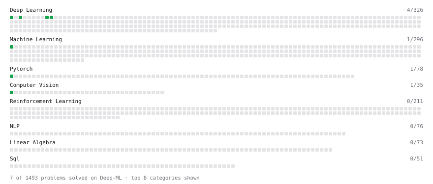

# Deep-ML

My machine learning practice from [Deep-ML](https://www.deep-ml.com). Every solution here was written by hand.

**8** solved · 7 problems · 0 labs · 1 math

[**Browse the interactive portfolio**](https://yashchks87.github.io/deep-ml/) to replay this filling in over time.

## Problems

| | Difficulty | Solved | |
| --- | --- | --- | --- |
| [Calculate Image Brightness](https://www.deep-ml.com/problems/70) | easy | 2026-10-01 | [solution](problems/0070-calculate-image-brightness) |
| [Create a Float Tensor from a Python List](https://www.deep-ml.com/problems/880) | easy | 2026-10-01 | [solution](problems/0880-create-a-float-tensor-from-a-python-list) |
| [Implement ReLU Activation Function](https://www.deep-ml.com/problems/42) | easy | 2026-10-01 | [solution](problems/0042-implement-relu-activation-function) |
| [Leaky ReLU Activation Function](https://www.deep-ml.com/problems/44) | easy | 2026-10-01 | [solution](problems/0044-leaky-relu-activation-function) |
| [Linear Regression Using Normal Equation](https://www.deep-ml.com/problems/14) | easy | 2026-10-01 | [solution](problems/0014-linear-regression-using-normal-equation) |
| [Sigmoid Activation Function Understanding](https://www.deep-ml.com/problems/22) | easy | 2026-10-01 | [solution](problems/0022-sigmoid-activation-function-understanding) |
| [Single Neuron](https://www.deep-ml.com/problems/24) | easy | 2026-10-01 | [solution](problems/0024-single-neuron) |

## Math

| | Difficulty | Solved | |
| --- | --- | --- | --- |
| [ML Workflow Basics](https://www.deep-ml.com/math-problems/30) | easy | 2026-09-03 | [solution](math/0030-ml-workflow-basics) |

---

_This file is regenerated by Deep-ML on every push._
